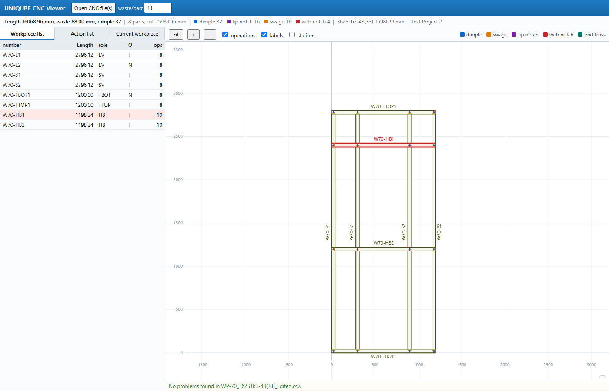
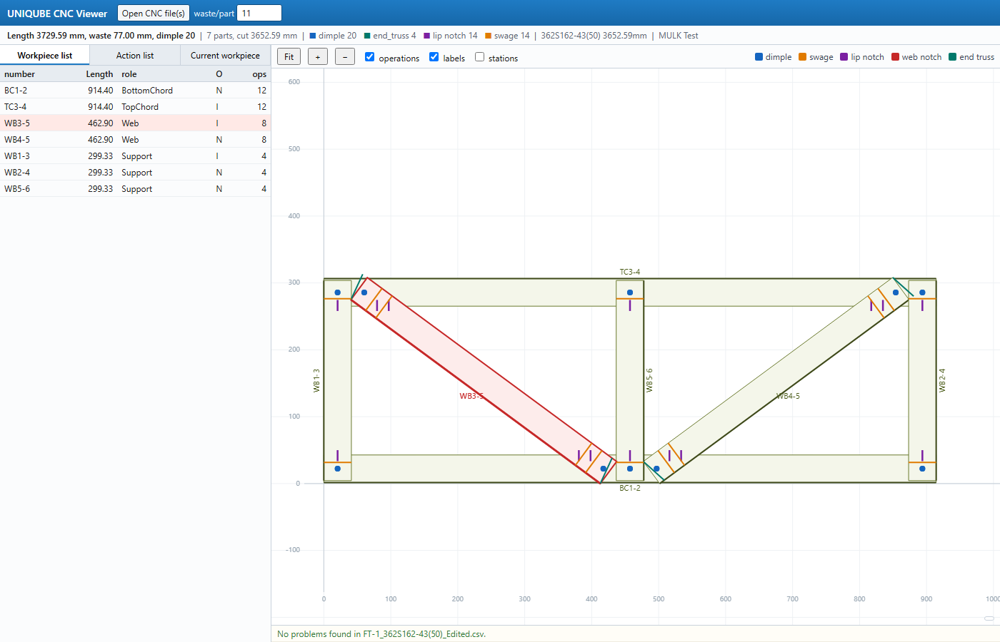

# UNIQUBE CNC Viewer

Opens a CNC `.csv` and draws the panel or truss it describes, the way the
rollformer's own software does, so a file can be checked before it reaches
the machine.

Double-click `index.html`. Nothing to install and no server: it is plain
HTML and JavaScript, and the file you open never leaves the laptop.

## Using it

Drop one or more `.csv` files onto the window, or use **Open CNC file(s)**.

- **Workpiece list** - every member with its cut length, role, orientation
  (N / I) and operation count. Click a row to highlight it in the drawing.
- **Action list** - the selected member's operations in order, measured
  both from the start and from the far end.
- **Current workpiece** - the selected member straightened out, as it
  leaves the machine, with every station marked.

In the drawing, click a member to select it, drag to pan, scroll to zoom,
**Fit** to frame the whole thing. The heavy dark line on each member is the
web, the closed back of the C, so it is obvious which way the section faces.
Turn on **stations** to print each operation's position.

The summary bar mirrors the machine's own wording, and adds the part count,
the cut length, a breakdown by operation and the coil length per section.
**waste/part** is the allowance added to each part; 11 mm reproduces the
totals our machine reports.

## What it checks

The strip along the bottom lists anything suspect rather than failing:

- an operation whose station falls outside the part
- a stated length that disagrees with the member's own endpoints
- a web depth that disagrees with the section name
- an orientation that is neither NORMAL nor INVERTED
- a section name that cannot be read, a duplicate label, a member with
  no operations

## Files

| file | purpose |
| --- | --- |
| `index.html` | layout and styling |
| `cnc.js` | CSV parsing, section decoding, geometry, checks |
| `viewer.js` | canvas drawing, tables, interaction |
| `test-cnc.js` | `node test-cnc.js` - parser checks against real machine files |
| `shot.js`, `shot-detail.js` | dev only: render headlessly to a PNG |

## The CSV it reads

One `DETAILS` row carrying the job name, then a `COMPONENT` row per member:

```
COMPONENT,label,section,role,orientation,qty,length,x0,y0,x1,y1,webDepth,OP,station,OP,...
```

`x0,y0` to `x1,y1` are the member's endpoints in the panel, in millimetres,
measured from the panel's bottom left. Stations are measured along the
member from its `x0,y0` end. Operations are `LIP NOTCH`, `WEB NOTCH`,
`DIMPLE`, `SWAGE` and `END_TRUSS`.

The section name supplies what the CSV does not state: `362S162-43(33)` is
a 3.62 in web by 1.62 in flange, 43 mil, 33 ksi. The flange is what the
member measures in the panel elevation, so it sets the drawn width; the web
matches the file's own web-depth column, which the viewer cross-checks.




